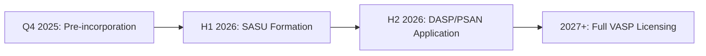

# SOLVIRA: Compliance & Operational Governance Policy


> **Official governance framework and compliance strategy for the SOLVIRA payment protocol**

This document outlines the governance measures, legal structuring roadmap, and compliance strategy adopted by the SOLVIRA project to ensure fund security and regulatory alignment.

---

## 📑 Table of Contents

- [Operational Governance](#-1-operational-governance-risk-management)
- [Legal & Regulatory Framework](#️-2-legal--regulatory-framework)
- [Fee Model & Transparency](#-3-fee-model--transparency)
- [Anti-Money Laundering & KYC](#-4-anti-money-laundering-aml--kyc)

---

## 🛡️ 1. Operational Governance (Risk Management)

The governance system is designed to **eliminate "Key Man Risk"** and ensure a mandatory reaction window for the community via Time-Locks.

### Governance Architecture

```
┌─────────────────────────────────────────────────────────────┐
│                  SOLVIRA GOVERNANCE FLOW                    │
├─────────────────────────────────────────────────────────────┤
│                                                             │
│  Gnosis Safe Multi-Sig (2/3)                               │
│         │                                                    │
│         ↓ (proposes)                                        │
│  TimelockController (48h delay)                            │
│         │                                                    │
│         ↓ (executes)                                        │
│  SOLVIRA Token Contract                                     │
│                                                             │
└─────────────────────────────────────────────────────────────┘
```

### Control Matrix

| Function | Mechanism | Control Entity | Transparency |
|:---------|:----------|:---------------|:-------------|
| **Operational Treasury (62.01% SLV)** | Gnosis Safe Multi-Sig (2 out of 3) | 3 Signers (Distributed) | Public on BaseScan |
| **Parameter Updates** | Timelock Controller (48 Hours) | Gnosis Safe (Proposer) | Mandatory delay for all admin actions |
| **Token & PoTT Management** | SOLVIRA.sol Contract | SolviraTimelock.sol | Code-enforced security |

### Safe Operator Policy

- ✅ Any operational expenditure (Marketing, Dev, Payroll) requires a consensus of **2 out of 3 signers**
- ✅ No single private key has direct control over the project's liquid assets
- ✅ All transactions are publicly verifiable on BaseScan
- ✅ 48-hour community window for all parameter changes

**Gnosis Safe Address (Base Mainnet):**  
`0xF1e029a360D2955B1Ea5bc0e2E210b706d1edBF7`

---

## ⚖️ 2. Legal & Regulatory Framework

SOLVIRA operates as a **"Utility Payment Protocol"** and follows a progressive compliance roadmap aligned with project growth.

### A. Legal Structure (Roadmap Alignment)



| Phase | Timeline | Status | Objective |
|:------|:---------|:-------|:----------|
| **Phase 1** | Q4 2025 | ✅ **Current** | Protocol Development (Pre-incorporation) |
| **Phase 2** | H1 2026 | 🔜 **Planned** | SASU incorporation (France) or equivalent international structure |
| **Phase 3** | H2 2026 | 📋 **Roadmap** | Merchant onboarding & fiat banking relationships |
| **Phase 4** | 2027+ | 🔮 **Vision** | Full DASP/PSAN/VASP licensing |

**Current Status:** Pre-incorporation phase (Protocol Development)

**Objective:** The formal incorporation of the legal entity (SASU in France or equivalent international structure) is scheduled for **Phase 2 of the Roadmap (H1 2026)**. This entity will handle merchant onboarding and fiat banking relationships once the Mainnet launch is stabilized.

### B. Targeted Regulatory Status (Global Standards)

SOLVIRA acknowledges the regulatory requirements regarding crypto-to-fiat flows.

#### Long-Term Ambition

Obtaining registration as a **DASP/PSAN** (Digital Asset Service Provider) in Europe (MiCA compliant) or equivalent **VASP** (Virtual Asset Service Provider) licenses in other jurisdictions.

#### Phase 1 Strategy (Delegation)

During the launch phase, SOLVIRA does **not directly custody user Fiat funds**. The payment and off-ramp functions are delegated to **Regulated Payment Service Providers (PSPs)** who already hold the necessary licenses:

- ✅ Stripe (PCI-DSS Level 1 certified)
- ✅ Coinbase Commerce (NMLS-licensed)
- ✅ Banking partners with full regulatory compliance

This approach ensures:
- 🔒 No direct fiat custody by SOLVIRA during launch phase
- 🏦 All fiat flows processed through licensed financial institutions
- ✅ Immediate compliance with payment processing regulations
- 🚀 Faster go-to-market while building internal compliance infrastructure

---

## 💰 3. Fee Model & Transparency

The **PoTT (Proof of Tangible Transaction)** mechanism is designed to fund the ecosystem sustainability.

### Fee Structure

| Fee Type | Rate | Purpose | Collection Method |
|:---------|:-----|:--------|:------------------|
| **Protocol Fee** | 1.00% | Protocol development, buy-backs, liquidity | Smart Contract (on-chain) |
| **Burn Fee** | 1.00% | Deflationary mechanism | Smart Contract (on-chain) |
| **External Fees** | Variable | Payment processor costs (Stripe, etc.) | Off-chain (merchant settlement) |
| **Gas Fees** | Network rate | Base network transaction fees | Blockchain network |

### PROTOCOL FEE (1%)

A fixed fee of **1%** is applied by the Smart Contract on merchant purchase transactions.

**Allocation:**
- Protocol development
- Token buy-backs (market support)
- Liquidity management
- Operational expenses (via Gnosis Safe governance)

**Collection:**
- ✅ Automatically collected by Treasury wallet
- ✅ Managed by Gnosis Safe multi-sig (2/3)
- ✅ Fully transparent on BaseScan

### EXTERNAL FEES

⚠️ **Important:** The 1% Protocol Fee does **NOT** cover third-party processing costs.

**Additional costs may include:**
- Payment processor fees (e.g., Stripe: ~2.9% + $0.30)
- Banking gateway fees
- Currency conversion fees
- Gas fees (Base network)

**Responsibility:**
- These fees remain the responsibility of the user or are deducted at settlement, depending on the specific merchant integration.

---

## 🔐 4. Anti-Money Laundering (AML) & KYC

Even in the launch phase, SOLVIRA enforces strict standards to prevent illicit usage of the protocol.

### Compliance Framework

```
┌─────────────────────────────────────────────────────────────┐
│                  COMPLIANCE ARCHITECTURE                    │
├─────────────────────────────────────────────────────────────┤
│                                                             │
│  User (Crypto Wallet) → No KYC Required                    │
│         │                                                    │
│         ↓ (PoTT transaction)                                │
│  SOLVIRA Protocol (Smart Contract)                         │
│         │                                                    │
│         ↓ (merchant settlement)                             │
│  Payment Service Provider (PSP)                             │
│         │ ← KYC/AML checks performed here                  │
│         ↓                                                    │
│  Merchant Bank Account (Fiat delivery)                      │
│                                                             │
└─────────────────────────────────────────────────────────────┘
```

### Partner Compliance (KYB)

**Know Your Business checks for all partners:**

| Partner Type | Verification Required | Responsibility |
|:-------------|:---------------------|:---------------|
| **Merchants** | Business registration, Tax ID, Banking details | SOLVIRA team |
| **Bullion Dealers** | Precious metals dealer license, Compliance certificates | SOLVIRA team |
| **Payment Processors** | Full regulatory licenses (PCI-DSS, NMLS, etc.) | Third-party PSPs |

**Process:**
1. ✅ All partner merchants and bullion dealers undergo strict KYB verification before integration
2. ✅ Documentation review (business registration, tax compliance, banking)
3. ✅ Background checks and reputation verification
4. ✅ Ongoing monitoring and periodic re-verification

### Fiat Flows

**All fiat currency flows are routed through regulated channels:**

- 🏦 **Outgoing flows** in Fiat currency (USD/EUR) are routed **exclusively** through:
  - Traditional banking systems
  - Regulated Payment Service Providers (PSPs)
- ✅ **AML/CFT checks** are performed by licensed financial institutions
- 🔒 **No direct fiat custody** by SOLVIRA during Phase 1
- 📊 **Full transaction traceability** via banking systems and blockchain

### User Privacy

**SOLVIRA respects user privacy while maintaining compliance:**

- ✅ **On-chain transactions:** Pseudonymous (wallet addresses only)
- ✅ **No KYC for token holders:** Holding SLV does not require identity verification
- ⚠️ **Merchant settlements:** KYC/AML performed by regulated PSPs during fiat off-ramp
- 🔒 **Data minimization:** Only necessary information collected for compliance

---

## 📞 Contact & Updates

### Governance Inquiries

- **Email:** governance@solvira.io
- **Security:** security@solvira.io

### Legal & Compliance

- **Email:** legal@solvira.io
- **Investor Relations:** invest@solvira.io

### Document Version

| Version | Date | Changes |
|:--------|:-----|:--------|
| **V1.0** | November 2025 | Initial governance policy release |

---

## ⚠️ Disclaimer

This document is subject to updates based on:
- Regulatory changes
- Legal structuring progress
- Roadmap evolution
- Community governance decisions

**Last Updated:** November 24, 2025  
**Status:** Active  
**Network:** Base Mainnet (Chain ID: 8453)

---

<div align="center">

**© 2025 SOLVIRA Project – All rights reserved.**

[Website](https://solvira.io) • [Docs](https://docs.solvira.io) • [GitHub](https://github.com/solvira) • [BaseScan](https://basescan.org)

</div>
